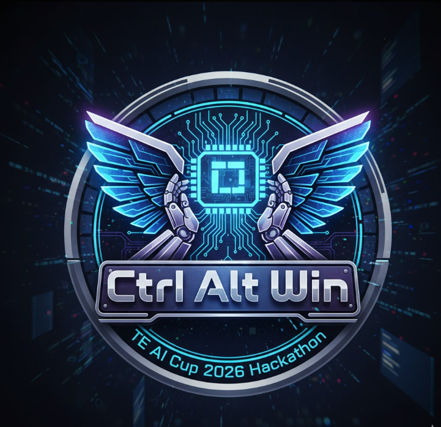

  

<h1 align="center">🧠 Machines Learn to Talk</h1>
<h3 align="center">AI Assistant for High-Speed Progressive Stamping Dies</h3>

This project is developed for <b>TE AI Cup 2026</b> as a complete AI-driven manufacturing decision support system.

---

## 📌 Project Overview  

This project builds an **AI-powered expert assistant** that analyzes machine data, detects early faults, and provides **expert-level reasoning** for high-speed progressive stamping dies.

The system works even **without real sensors**, using:
- synthetic sensor data  
- open industrial datasets  
- LLM + RAG reasoning  
- machine learning anomaly detection  

The solution focuses on:
- **Low cost**
- **Rapid deployment**
- **High accuracy**
- **Worker-friendly explanations**

---

## 🎯 Problem Statement  

Modern stamping die machines generate large amounts of performance and sensor data, but:
- Skilled engineers are limited  
- New workers struggle with machine failures  
- Wrong decisions lead to downtime  
- Existing tools are expensive  

The TE AI Cup challenges us to build an **AI solution that reasons like an expert**, detects faults, explains causes, and suggests corrective actions in real time.

---

## ✨ Key Features  

### 🟦 Machine Learning (ML)
- Anomaly Detection  
- Fault Classification  
- Performance Trend Analysis  
- Works with synthetic + open datasets  

### 🟪 LLM + RAG Reasoning
- GPT/LLaMA-powered expert system  
- Real-time explanations in simple language  
- Root cause analysis (RCA)  
- Recommendations for maintenance  

### 🟧 Knowledge Base (KB)
- Six Sigma rules  
- Red-X methodology  
- Stamping die failure patterns  
- Maintenance checklists  

### 🟩 Worker Dashboard (UI)
- Live charts  
- Fault alerts  
- Chatbot assistant  
- Maintenance suggestions  

### 🟨 Cost-Efficient Design
- Runs with zero physical sensors  
- Scalable to real factory IoT later  
- Deployable on laptop or cloud  

---

## 🏗️ System Architecture  

